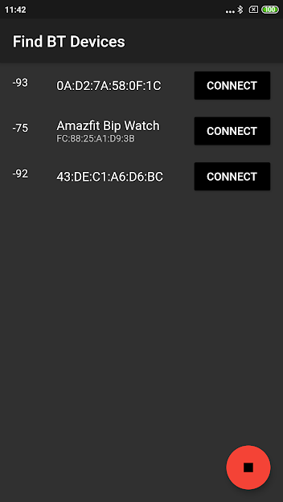

# flutter_ble_app

Simple Flutter App that allows you to monitor changes in temperature, humidity, pressure or battery level received from Waspmote Device. It was also used successfully with ESP32 and in this case remote characteristic writing is also possible. Based on Flutter Blue example
# Plotting received data in real time
|
# Now all the data can be saved to CSV file 
|
# Remote writing to characteristic (light bulb icon) (also as a chat experimentally)
|

## Current preview (dark theme)

## Old preview (light theme)

